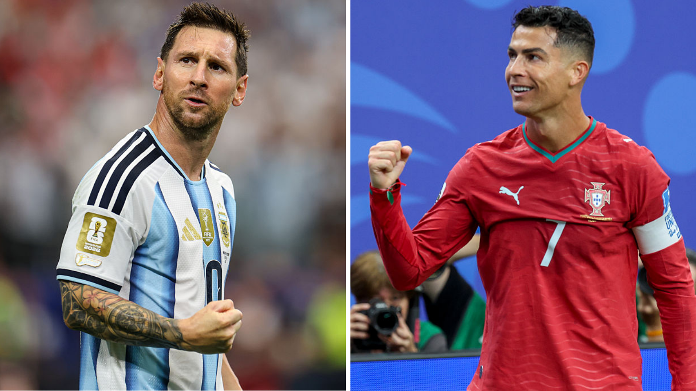

Today's date is 7 July, which is 7/7. To many cultures, 7 is considered a lucky number. To me, however, it means far more than just a lucky number. It represents the iconic number 7 worn by Cristiano Ronaldo, or the iconic nickname CR7.

As the final whistle blew, agony struck as I hopelessly watched Ronaldo's World Cup dream slip away. This is the reality of football. It is devastating and harsh.

Amidst all these feelings, the age-old debate sprawled across social media. "The GOAT debate was never a debate", "Is this your GOAT?", "Why are people even debating whether Messi or Ronaldo is the GOAT? Messi is clearly better, isn't he?".

I would argue that the GOAT (Greatest Of All Time) would depend heavily on how one defines "Greatest". It can mean being the BEST player of all time. Clearly, Messi is the GOAT in this case. The stats back him up. The performances back him up. The trophies back him up. His stellar career speaks for itself. Every time he steps on the pitch, defenders fear for themselves. Truly the best player of all time football wise.

However, I would define "Greatest" as the most "Impactful". To me, greatness is beyond pure ability and performance on the pitch. It is about the impact the player has on the world, the influence the player has on people, the inspiration for children and teenagers to pursue their dreams and the legacy they leave behind.

By this definition, Cristiano Ronaldo is my GOAT.

Setting aside his footballing abilities, Ronaldo's impact is beyond any other footballers who have graced the planet. He is the embodiment of ambition, perseverance and discipline. Growing up in the streets of Madeira, he built up his career season by season and eventually became the most recognisable athlete IF NOT the most well-known human being right now.

What makes this journey remarkable and inspiring is that all of this was achieved through pure hard work and an unbreakable mentality. The way he responds to criticism, the way he carries himself under pressure, the way he speaks in interviews reveal a person with immense self-belief and a refusal to be defined by others' opinions.

Ronaldo is also associated with iconic moments that football history will never forget. The bicycle kick against Juventus in the Champions League knockouts. The hat-trick against Atletico to secure a comeback win. The UCL 3-peat. Most importantly, the iconic SIUUUUUU celebration that is widely recognised across the world.

The 2026 FIFA World Cup signifies the end of Ronaldo's World Cup career (surely). Although he has been knocked out and the World Cup dream is over, Cristiano will still be Cristiano. He will not be defined as the player who did not win a World Cup. He will be remembered as the player who brought Portuguese football to the highest level.

Right now, Messi's Argentina is doing pretty well in the World Cup and might have a chance of winning it again this year. Who knows? Maybe the fairy-tale script from 2022 hasn't ended yet for Messi. With Portugal out (I will never support them again tbf, now that Ronaldo has retired from Portugal), my hope lies in "Dictator" Mbappe's France. Perhaps we can see someone who idolises CR7 carry on his legacy and follow his footsteps?

Maybe someone don't like Ronaldo because maybe he's too good.

P.S. Ronaldo currently sits at 976, 24 away from the 1000 goals. MOST of all time btw.
