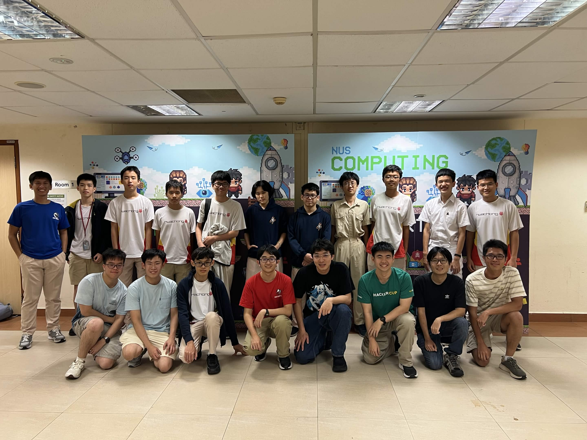

This was a rollercoaster of emotions.

## Preparations

Some might say the real competition begins long before the contest day itself.

I was quite fortunate and thrilled to be one of the five (actually six) top contestants from my school who qualified for the finals, especially after missing out from last year's NOI. Hence, I told myself that I would work as hard as possible to achieve one of my ultimate goals ever since coming to Singapore: attaining a Gold Medal at the NOI.

I grinded like crazy. I was given permission to skip math and computing lessons in school to grind for NOI. Every day, I tried to solve at least 2 to 3 problems or 1 hard problem. I revisited problems from past editions of NOI Finals, as well as doing recommended problems from my peers. I basically ate, slept and breathed CP for three weeks straight. Additionally, I took the last few days before the competition to refine my hardcopy notes (which I did NOT touch at all during the contest).

D-Day finally came. I was delighted and grateful for having met so many people that I know. From SJI juniors to CPIC friends. The lunch at NUS was bussing as well. During the practice session, I was quite thrilled to hear that there was a "communication" problem this year. A part of me wanted this problem to be the first one in the contest. Overall, it was good to be back after 2 years.

## Showtime

Although problem 1 is supposed to be insta-kill-able, I was bugging out for some reason when I tried to implement the brute force subtask to verify my logic. However, it was smooth sailing once I eventually got the 56 points from implementing the `O(n^2)` solution. I then immediately thought of the full solution and AC-ed the question around one hour into the contest.

Actually, that was all the things that went well for me in this contest. Problem 2 was a killer. I had absolutely no idea how to solve it after reading and thinking for the next one hour. So, I decided to jump to problems 3 and 4 to try to grab as many points as I could from subtasks (which I was able to grab 16 points total).

By this point, I decided that if I were to achieve the Gold Medal, I had to AC problem 2 no matter what (because it looked solvable as well). I spent the rest of the contest trying various approaches: dp, greedy, brute force,... I was running out of ideas. By a miracle, my (regretful?) greedy solution was able to clear 21 points for the problem, bringing my total score to 137. I really thought my regretful greedy solution was the full solution, just that it was full of bugs. However, luck was not on my side and time ran out without me seeing green on the submission page.

By the way, the communication problem was the fifth problem. I did not even bother to read the task statement.

## Takeaways

Disappointment was my first reaction. I knew that my score would definitely not be enough for Gold. Looking back, my decision to go all-in for problem 2 was a huge "go big or go home" risk. While I managed to scavenge 21 points, I have to wonder if all the time I spent debugging and racking my brain out for this problem was better spent maxing out the subtasks for problems 3 and 4. I could have also just go for the much easier, less nerve-racking subtasks in problem 2. This was poor contest strategy on my end, perhaps due to my immense anxiety. My takeaway from this is that maximising guaranteed points before committing to high-risk solutions is often the better strategy.

Although a disappointing result by my standards, I must say that I have grown a lot. The fact that the Gold Medal was such an achievable goal compared to in 2024 (when I was simply hoping to scrape a Silver) was a testament to my hard work over the past few months.

A few days later, I was relieved to find out that I had secured Silver. This marks my third Silver as well as the end of my NOI journey in Singapore. Overall, NOI 2026 was an invaluable experience that helped me learn a lot about myself while allowing me to connect with more people in the competitive progrmaming community in Singapore.

